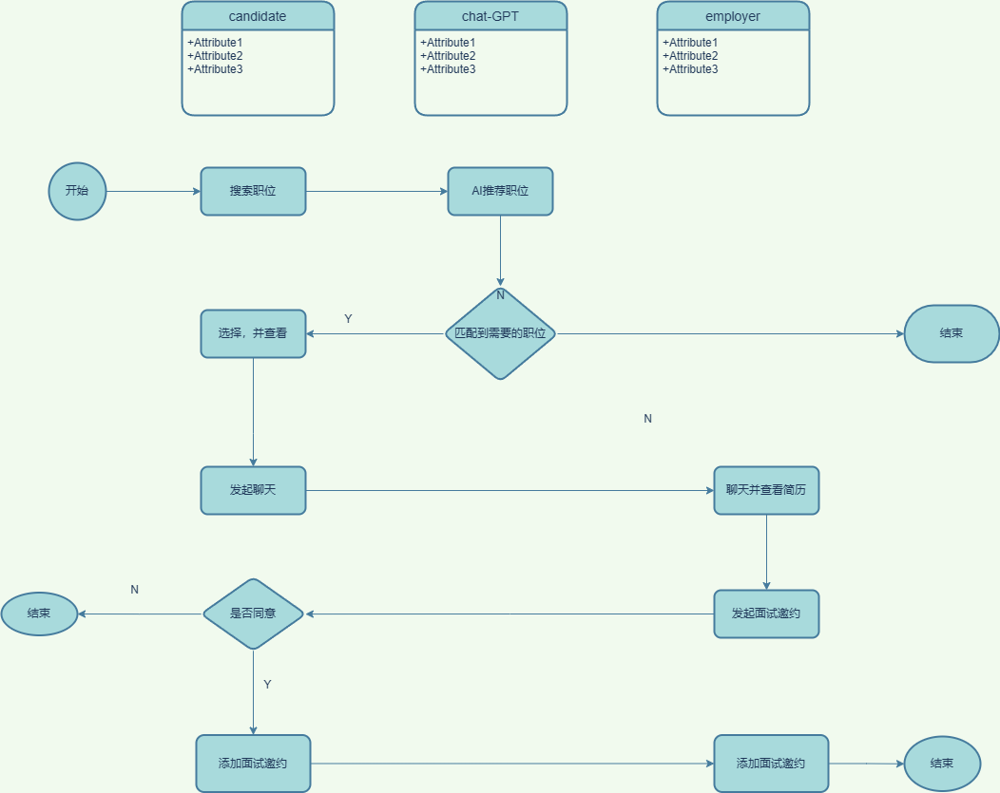
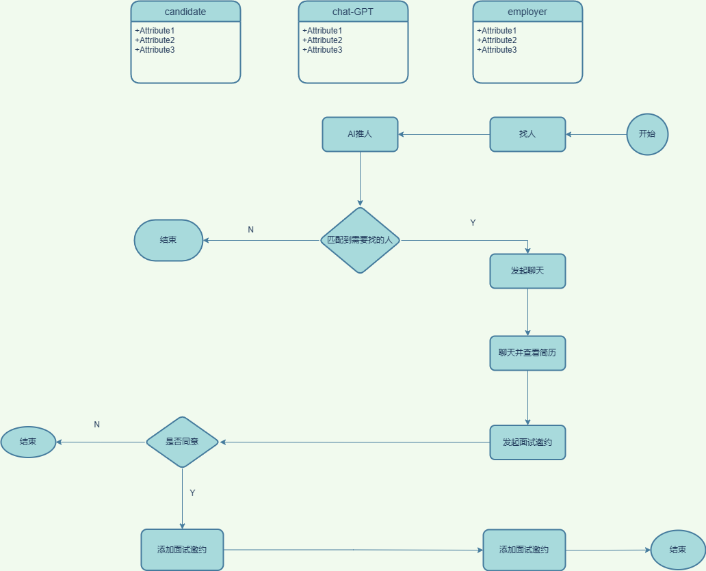

# Project Grapefruit

Project grapefruit is a web backend of Three-Visits
# candidate

# employer


## Features

-  RPC.
-  TCP.
-  Websocket.
-  EventSource.
-  Http.
-  Chat-GPT

## Technology Stack

- Language: [golang]
- Databases: [Mongo,Redis,ElasticSearch]
- Middleware: [JWT,Swagger,GORM]
- Other Technologies: [Sonic ,Spoor]

## Architecture Design

- The project follows Domain-Driven Design (DDD) as the architectural design concept, dividing the business domain into different subdomains and implementing concepts like domain models, aggregates, entities, value objects, and domain services within each subdomain. 

### -[cmd 工具 
### -[config 配置，常量
### -[docs 文档，swagger 生成
### -[internal 主要逻辑
***-[adapter*** 适配器
***-[app*** 应用biz
***-[domain*** 值对象
###  -[kit 工具箱
###  -[script devops 会用到的脚本
***-Dockerfile***  构建容器的时候会用到
***-buildspec.yml*** aws 构建时会用到的


## Module Organization


## API Documentation

- The project utilizes Swagger as the API documentation tool, providing detailed interface documentation along with sample requests/responses.

## RPC

- RPC (Remote Procedure Call) is used to facilitate communication and service invocation between modules.

## TCP

- TCP protocol is employed for specific functionalities or communication with other systems.

## WebSocket

- WebSocket is implemented to enable real-time bidirectional communication, such as chat rooms or real-time data streaming.

## EventSource

- EventSource (Server-Sent Events) is used to push server-generated events to clients.

## Data Storage

- Databases: The project utilizes the following databases for data storage:
    - Redis: Used for caching or implementing specific functionalities.
    - Elasticsearch (ES): Employed for full-text search and real-time analytics.
    - MongoDB: Utilized for storing and querying unstructured data or complex data models.

## Installation and Running
***launch postgresql***
***create table and database***
```sql
 execute  ./docs/script.sql
```
***run***
```shell
  go run main.go
```
## Testing


## Contributions


## Authors

- phuhao00.

## References

